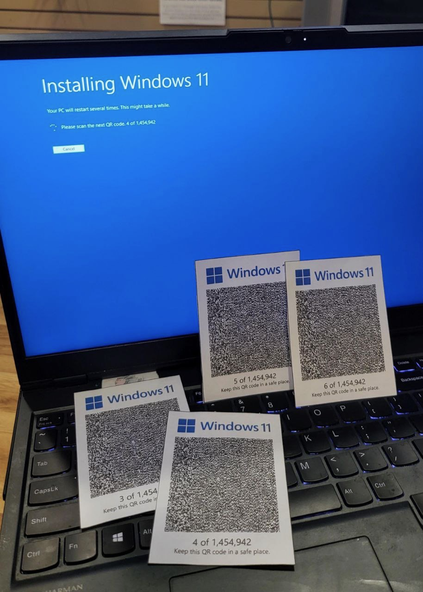

# Qrs

Stream data through multiple QRCodes, a bit like this meme:

## Usage

Website: https://qrss.netlify.app/

## Knowledge

<!-- 这种流式播放二维码传输数据的情况。类似“二进制抹去通道（Binary Erasure Channel, BEC）”，这是一种通信模型。在这个模型中，发送方发送二进制数据（0或1），接收方有一定概率无法接收到某些数据位，这些位会被标记为“抹去”或“丢失”。换句话说，接收方知道哪些位丢失了，但不知道它们的具体值。这个模型用于研究和设计能够在数据丢失情况下仍能有效传输信息的编码技术。

科学家对于如何在 BEC 中高效传输数据已经有了非常成熟的研究成果，其中一种方法是使用“喷泉码（Fountain Codes）”。喷泉码是一种纠错码，它可以在数据丢失的情况下仍然有效地传输信息。本项目使用了 Luby Transform 编码。它是喷泉码（Fountain Codes）的一种。基本原理是将原始数据分成多个小块，然后通过编码生成无限数量的编码块。接收方只需收到足够多的编码块（通常比原始块稍多）就可以重建原始数据。 -->

This situation of streaming QR code data transmission is similar to the "Binary Erasure Channel (BEC)," which is a communication model. In this model, the sender transmits binary data (0 or 1), and the receiver has a certain probability of not receiving some data bits, which are marked as "erased" or "lost." In other words, the receiver knows which bits are lost but does not know their specific values. This model is used to study and design coding techniques that can effectively transmit information even in cases of data loss.

Scientists have already achieved very mature research results on how to efficiently transmit data in BEC, one of which is using "Fountain Codes." Fountain Codes are a type of error-correcting code that can effectively transmit information even in the case of data loss. This project uses Luby Transform coding, which is a type of Fountain Code. The basic principle is to divide the original data into multiple small blocks and then generate an unlimited number of encoded blocks through encoding. The receiver only needs to receive enough encoded blocks (usually slightly more than the original blocks) to reconstruct the original data.

## Demo

<video src="https://github.com/user-attachments/assets/b4f8a122-02c7-4754-9ec0-121e42f8b22d"></video>

## Reference

### Fountain Codes

- [Fountain codes and animated QR](https://divan.dev/posts/fountaincodes/)
- [LT codes -- a design and analysis epiphany](https://youtu.be/C4qi_oJoUrE)
- [gofountain](https://github.com/google/gofountain)

### QR Codes

- [Anthony's QR Toolkit](https://github.com/antfu/qrcode-toolkit)
